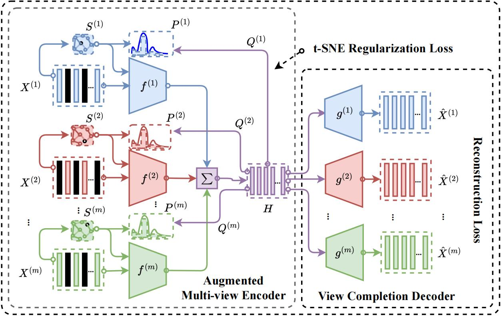

# Graph t-SNE Multi-view Autoencoder (GTSNE-MvAE)




## TL;DR

This is the PyTorch implementation of the GTSNE-MvAE model for joint clustering and completion of incomplete multi-view data. The core idea is to formulate the view completion task as a multi-view multivariate regression problem and augment a multi-view autoencoder for both completion and clustering. The augmentation is based on the graph convolutional layer and t-SNE loss, inspired by the graph t-SNE technique. We further improve the augmentation by imposing the regularization *after-fusion* of individual representations, which proves to be useful.

## Run our code

```
pip install -r requirements.txt
python run.py
```

If you are using Mac with apple chip, please use the `install-mac.sh` to setup `torch-geometric`.

Once you run `run.py`, you can see logs similar to the following,
```
INFO:root:Load args {'batch_size': 1024,
 'before': False,
 'complete_ratio': 0.5,
 'datadir': 'data',
 'dataname': 'Scene-15',
 'datapath': PosixPath('data/Scene-15.mat'),
 'debug': False,
 'device': 'cpu',
 'epochs': 500,
 'eval_epochs': 10,
 'hidden_dims': 128,
 'incomplete_ratio': 0.5,
 'lamda': 0.1,
 'lr': 0.001,
 'perplexity': 10,
 'save_vars': True,
 'savedir': PosixPath('output/exp'),
 'seed': 123,
 'use_mlp': False,
 'views': [0, 1]}
INFO:root:Training begins
INFO:root:Loaded dataset Scene-15, #views 2 complete_ratio 0.5
INFO:root:************* Begin train completion model **************
INFO:root:epoch 0009 loss 0.5489 {'MSE': 0.0568, 'ACC': 0.2774, 'NMI': 0.3107, 'PUR': 0.3133, 'F1': 0.2706, 'ARI': 0.15}
INFO:root:Save best model to output/exp/model.pth
INFO:root:epoch 0019 loss 0.5407 {'MSE': 0.053, 'ACC': 0.3273, 'NMI': 0.3437, 'PUR': 0.3507, 'F1': 0.3176, 'ARI': 0.1764}

(More logs)

INFO:root:epoch 0489 loss 0.4788 {'MSE': 0.0056, 'ACC': 0.3759, 'NMI': 0.4136, 'PUR': 0.406, 'F1': 0.3641, 'ARI': 0.2291}
INFO:root:Save best model to output/exp/model.pth
INFO:root:epoch 0499 loss 0.4788 {'MSE': 0.0056, 'ACC': 0.3697, 'NMI': 0.4166, 'PUR': 0.412, 'F1': 0.3632, 'ARI': 0.2256}
INFO:root:Save best model to output/exp/model.pth
INFO:root:Train ends
INFO:root:************* Begin postprocessing **************
INFO:root:After training, metrics {'MSE': 0.0056, 'ACC': 0.4243, 'NMI': 0.4247, 'PUR': 0.4379, 'F1': 0.4072, 'ARI': 0.2521}
INFO:root:save_json metrics.json
INFO:root:save_json args.json
INFO:root:visualize_completion for output
INFO:root:savefig output/exp/vis/output-H_common.png
INFO:root:Done H_common
INFO:root:savefig output/exp/vis/output-gnd_hat.png
INFO:root:Done gnd hat
INFO:root:savefig output/exp/vis/output-history-mse.png
INFO:root:savefig output/exp/vis/output-history-cluster.png
INFO:root:Done history
INFO:root:savefig output/exp/vis/output-scatters.png
INFO:root:Done scatters
```
Note the visualizations will be saved to `output/exp/`, where you can supervise the training process. We provide all the used datasets under the `data/` directory and default configurations for each of them under `config/`.


## Thanks

Our GCN implementation is based on the `torch-geometric` package. The t-SNE loss computation is based on the Pytorch implementation of the parametric t-SNE method.

## Help wanted

It may be interesting to cast our PyTorch implementation to a Keras one, which may help us reach a wider audience :).


## Citation

Right now our work is under review.
